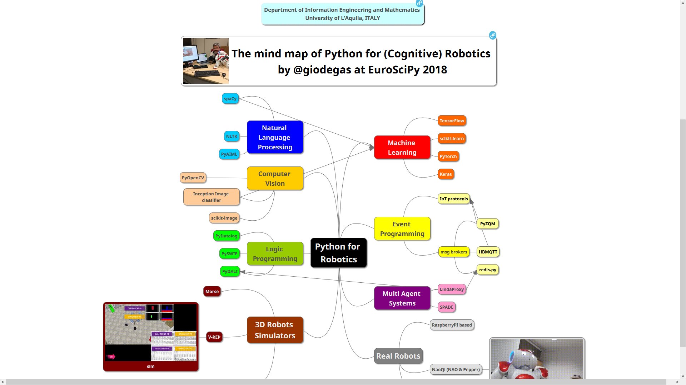

# Python for Cognitive Robotics mind map

## by [@giodegas](http://twitter.com/giodegas) , presented at [EuroSciPy2018](http://www.euroscipy.org/2018/), 31 August 2018, [Trento, IT](http://en.wikipedia.org/wiki/Trento)

This is my idea about how to use Python to design and build cognitive robots that can work in unstructured environments, percepts the worlds and deal with people.

## REFERENCES

### Natural Language Processing

* [spaCy](http://spacy.io)
* [NLTK](http://www.nltk.org)
* [PyAIML](http://github.com/cdwfs/pyaiml)

### Computer Vision

* [opencv-python](http://github.com/skvark/opencv-python) with [OpenCV](http://opencv.org)
* [scikit-image](http://scikit-image.org)
* [Inception image classifier](http://www.tensorflow.org/tutorials/images/image_recognition)

### Logic Programming

* [PyDatalog](http://sites.google.com/site/pydatalog/home)
* [PyDALI](http://github.com/AAAI-DISIM-UnivAQ/PyDALI) and [DALI](http://github.com/AAAI-DISIM-UnivAQ/DALI)
* [PySWIP](http://github.com/yuce/pyswip) with [SWI-Prolog](http://www.swi-prolog.org)

### 3D Robots Simulators

* [Morse](http://www.openrobots.org/wiki/morse)
* [pygazebo](http://github.com/jpieper/pygazebo) with [Gazebo](http://gazebosim.org)
* [prothonics-vrep](http://github.com/AAAI-DISIM-UnivAQ/prothonics-vrep) with [V-REP](http://www.coppeliarobotics.com)

### Machine Learning

* [TensorFlow](http://www.tensorflow.org)
* [scikit-learn](http://scikit-learn.org)
* [PyTorch](http://pytorch.org)
* [Keras](http://keras.io)

### Event Programming

* [PyZQM](http://zeromq.org/bindings:python) with [ZeroMQ](http://zeromq.org)
* [HBMQTT](http://github.com/beerfactory/hbmqtt) with [Mosquitto](http://mosquitto.org)
* [redis-py](http://github.com/andymccurdy/redis-py) with [Redis](http://redis.io)

### Multi Agent Systems

* [SPADE](http://github.com/javipalanca/SPADE)
* [LindaProxy](http://github.com/AAAI-DISIM-UnivAQ/LindaProxy) with [DALI](http://github.com/AAAI-DISIM-UnivAQ/DALI)

### Real Robots

* [SDK](http://doc.aldebaran.com/2-8/dev/python/install_guide.html) for [NAOqi](http://doc.aldebaran.com/2-8/index_dev_guide.html) platforms
* [rospy](http://wiki.ros.org/rospy) with [ROS](http://www.ros.org)
* [RaspberryPI](http://www.raspberrypi.org) based robots [1](http://github.com/nasa-jpl/open-source-rover) [2](http://www.researchgate.net/publication/289108931_Open_Source_Mobile_Robot_with_Raspberry_Pi)
