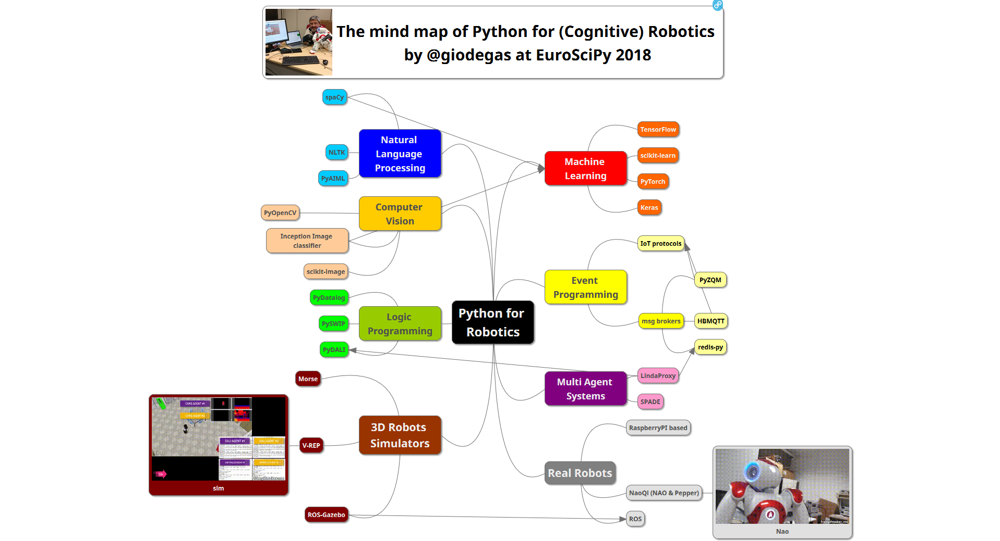

# Python for Cognitive Robotics mind map

## by @giodegas , presented at [EuroSciPy2018](http://www.euroscipy.org/2018/), 31 August 2018, [Trento, IT](http://en.wikipedia.org/wiki/Trento)

This is my idea about how to use Python to design and build cognitive robots that can work in unstructured environments, percepts the worlds and deal with people.

## REFERENCES

### Natural Language Processing

* spaCy
* NLTK
* PyAIML

### Computer Vision

* OpenCV
* scikit-image
* Inception image classifier

### Logic Programming

* PyDatalog
* PyDALI and DALI
* PySWIP and SWI-Prolog

### 3D Robots Simulators

* Morse
* Gazebo
* V-REP

### Machine Learning

* TensorFlow
* scikit-learn
* PyTorch
* Keras

### Event Programming

* PyZQM
* MBMQTT with Mosquitto
* redis-py with Redis

### Multi Agent Systems

* SPADE
* LindaProxy with DALI

### Real Robots

* NAOqi platforms
* rospy with ROS
* RaspberryPI based robots
